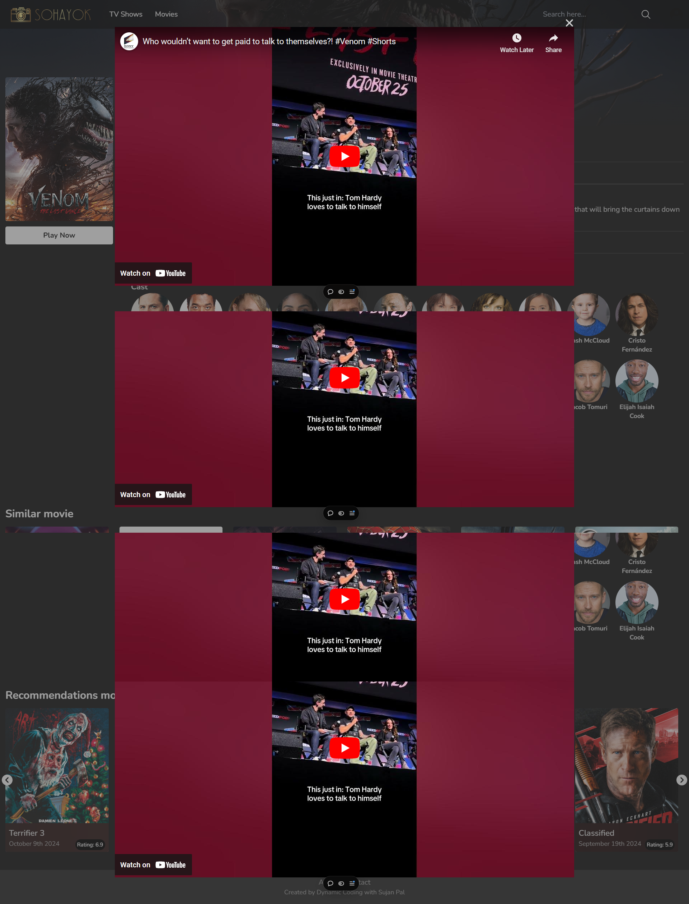
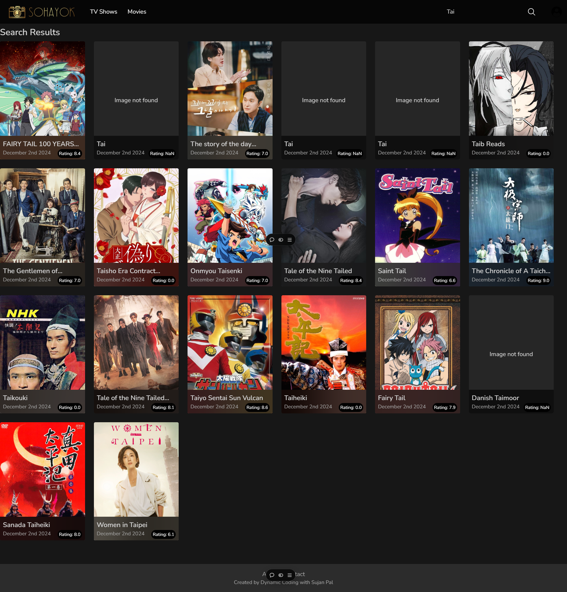

- Install React App Movieapp
  - npx create-react-app movieapp
- Install Tailwind Css
  - Follow this link https://tailwindcss.com/docs/guides/create-react-app
- Added Gogglefont
- Install - npm i react-router-dom
- Install React-icon https://react-icons.github.io/react-icons/

## Screenshots

### Home Page

### Movie Details Page

### FMovie Playing Page

### Search Result Page

